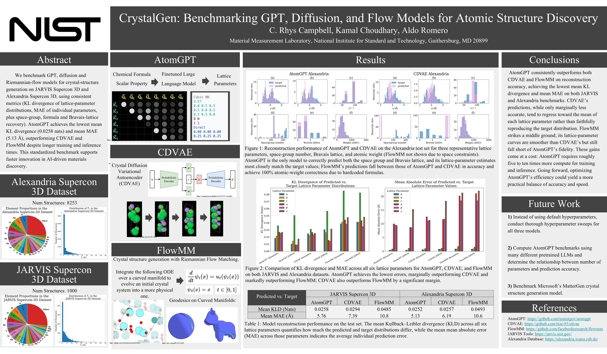

# benchmarks

#### Coming soon: CrystalGen software in [github.com/atomgptlab](https://github.com/atomgptlab/) that automates benchmark experiments and machine learning crystal structure generation!



## Install dependencies
1) Install models as submodules
2) Install mamba to speed up conda env creation
3) Install base python dependencies
```bash
git submodule update --init --recursive
conda install -n base -c conda-forge mamba
pip install uv dvc snakemake
```

## Compute benchmarks
1) Navigate to [scripts/wandb_api_key.sh](scripts/wandb_api_key.sh) and populate with a valid wandb_api_key
2) Run this command to automatically recompute benchmarks, metrics, and figures:
```bash
snakemake all --cores all
```

## Installation & Usage Tutorials
### AtomGPT
github.com/knc6/jarvis-tools-notebooks/blob/master/jarvis-tools-notebooks/atomgpt_example.ipynb

### CDVAE
github.com/crhysc/jarvis-tools-notebooks/blob/master/jarvis-tools-notebooks/cdvae_example.ipynb

### FlowMM
github.com/crhysc/jarvis-tools-notebooks/blob/master/jarvis-tools-notebooks/flowmm_example.ipynb
